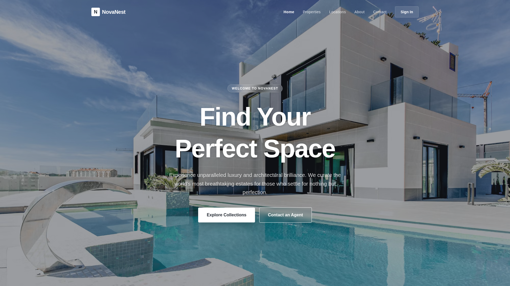

# NovaFest
in Section 'Features' 

## Features 
   
https://novanest-1.netlify.app/

## Overview
A comprehensive E-Commerce platform featuring a modern UI and a robust backend. The project has been fully migrated to JavaScript (both frontend and backend).

## Features
- Scalable Node.js & Express API backend
- Modern Vite + React frontend
- Fully JavaScript-based codebase
- Tailwind CSS styling

## Tech Stack
- **Frontend**: React, Vite, tailwindcss
- **Backend**: Node.js, Express, MongoDB

## Setup Instructions

### Backend
1. `cd ecommerce-backend`
2. `npm install`
3. Configure environment variables in `.env`
4. `npm run dev` to start the backend development server.

### Frontend
1. `cd ecommerce-frontend`
2. `npm install`
3. `npm run dev` to start the Vite server.

## Author
Maintained and updated by knockknock10
